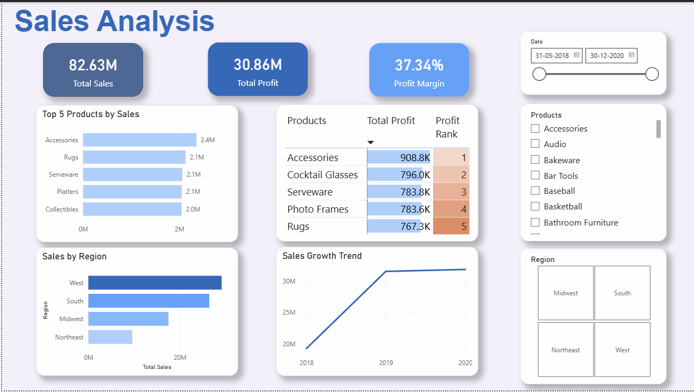
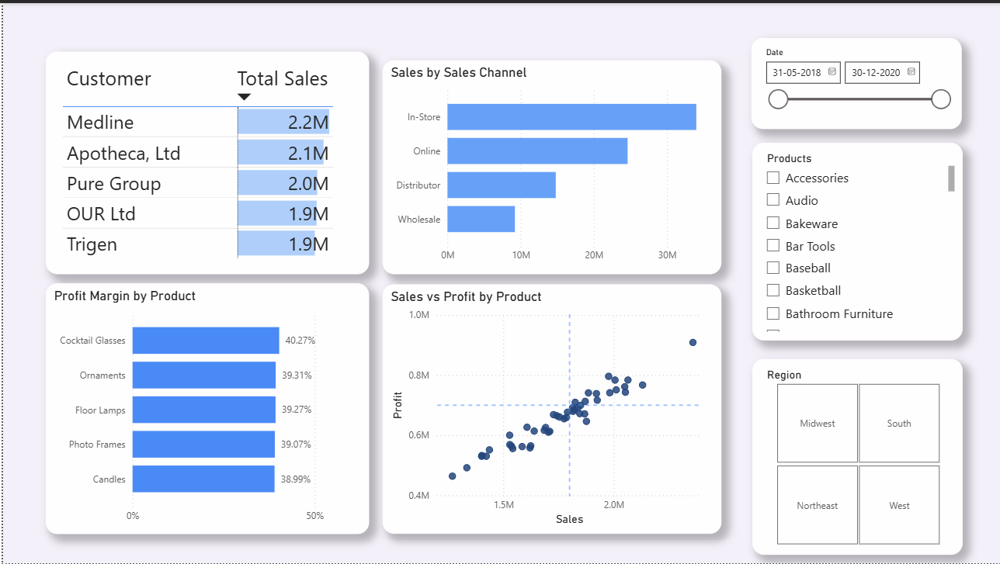

# End-to-End Retail Sales Intelligence Platform



---

## Table of Contents
- [Project Overview](#project-overview)
- [Dataset](#dataset)
- [Tools & Technologies](#tools--technologies)
- [Pipeline Architecture](#pipeline-architecture)
- [Repository Structure](#repository-structure)
- [Dashboard Walkthrough](#dashboard-walkthrough)
- [Key Insights](#key-insights)
- [Limitations](#limitations)

---

## Project Overview

This project builds a complete data analytics pipeline for a retail business — from raw Excel data through to an interactive Power BI dashboard analyzing over **$82.63 million in sales**.

The central question I wanted to answer was: **which channels, regions, and products are actually driving profitability, and where are the gaps?**

I handled the data cleaning, SQL analysis, and dashboard development myself.

---

## Dataset

- **Source:** Raw retail transaction data in Excel format
- **Size:** 8,000+ rows
- **Coverage:** Sales transactions across multiple regions, channels, and product categories

---

## Tools & Technologies

| Tool | Purpose |
|------|---------|
| Python (Pandas) | Data cleaning and ETL pipeline |
| SQL (MySQL) | Data exploration and advanced analysis |
| Power BI | Interactive dashboard and KPI reporting |
| Excel | Raw data source and initial inspection |

---

## Pipeline Architecture

```
[Excel Data]      Raw transactions (8,000+ rows)
      ↓
[Data Cleaning]   Pandas — deduplication, missing value handling,
                  feature engineering
      ↓
[SQL Analysis]    Aggregations, window functions, cohort analysis,
                  rolling averages, Pareto analysis
      ↓
[Data Modeling]   Star schema (fact and dimension tables)
      ↓
[Power BI]        Interactive dashboard with DAX measures
      ↓
[Key Insights]    Channel, regional, and product performance findings
```

---

## Repository Structure

```
├── docs/
│   ├── Business_Requirements.md
│   ├── Data_Dictionary.md
│   └── DAX_Measures.md
├── scripts/
│   └── data_cleaning_pipeline.py
├── notebooks/
│   └── Exploratory_Data_Analysis.ipynb
├── sql/
│   ├── 01_table_creation.sql
│   ├── 02_data_exploration.sql
│   └── 03_advanced_analytics.sql
├── dashboards/
│   └── Dashboard_Export.pdf
├── images/
└── README.md
```

**Key files:**
- `data_cleaning_pipeline.py` — Python script for cleaning and preparing raw data
- `02_data_exploration.sql` — Aggregations and month-on-month growth using window functions
- `03_advanced_analytics.sql` — Cohort analysis, 7-day rolling averages, and Pareto analysis
- `DAX_Measures.md` — Documents the DAX formulas used in the Power BI dashboard

---

## Dashboard Walkthrough

### Executive Overview
High-level KPIs covering total revenue, profitability, and top-performing products across all channels and regions.


### Customer & Product Analysis
Breakdown of margins by product category, key account performance, and cross-channel comparison.



---

## Key Insights

**1. In-store sales dominate revenue**
Despite assumptions about digital growth, in-store transactions account for the vast majority of the $82.63M in total revenue — significantly outperforming both online and wholesale channels.

**2. Regional performance gap**
The West region generates the highest sales volume, while the Northeast records the lowest. This gap suggests that regional factors — whether marketing, distribution, or customer mix — are worth investigating further.

**3. High volume does not always mean high margin**
Accessories generate strong sales volume and maintain solid margins. However, niche products like Cocktail Glasses show the highest overall profit margin at 40.27%, despite lower volume. This points to an opportunity in premium, low-volume product lines.

---

## Limitations

- The dataset does not include timestamps granular enough for day-level trend analysis in some queries
- The ETL pipeline was built with AI assistance and is intended as a learning artifact rather than production code
- The Power BI dashboard is exported as a PDF; live interactivity requires Power BI Desktop or Service
